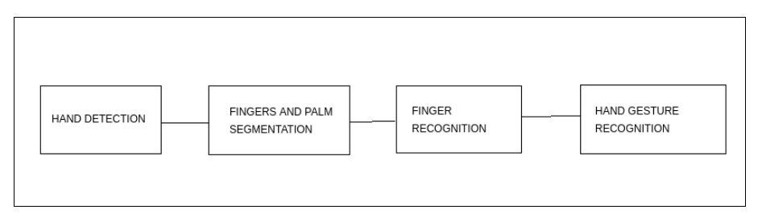

# GestureLingo
# A Sign Language Recognition System for Speech-Impaired People

## Aim
The aim behind this work is to develop a system for recognizing the sign language, which provides communication between people with speech impairment and normal people, thereby reducing the communication gap between them.

## Objective
The main objective is to translate sign language to text/speech. It provides a helping-hand for speech-impaired to communicate with the rest of the world using sign language. This leads to the elimination of the middle person who generally acts as a medium of translation. This would contain a user-friendly environment for the user by providing speech/text output for a sign gesture input.

## Problem definition
The only mode of interaction for deaf-mute people is sign language. The problem is not confined only to a deaf-mute person who is unable to hear or speak, but another problem is lack of awareness of deaf culture by normal people. Majority of hearing people have either no/little knowledge or experience of sign language . There are also more than 300 sign languages and it is hard for a normal person to understand and become used to these languages. Hence it creates a communication barrier between the disabled and society.

## Technology being used
- Python 3.7
- TensorFlow
- Keras
- OpenCV
- MySQL
- Text-to-Speech API

## Algorithms used
1. Rule Based Classifier
2. Background subtraction method by detecting the color of skin using HSV (Hue Saturation Value) model.

## Implementation

1. This system would involve 4 steps:

- Hand detection
- Fingers and Palm Segmentation.
- Finger Recognition
- Hand Gesture Recognition

2. **Label the gestures using OpenCV**
Captures images of hands using VideoCapture and frame function which uses web cam feed.

3. **Adding variations**
Captures images at different angles and rotations and flipping the images matches them with labels.

4. **Store in database** 
Consists of captured gestures based on American Sign Language. 

5. **Train the model** - using Keras

6. **Testing** - Testing of the model with real-time gesture use.

### For more information
Refer to this video (https://youtu.be/DAqnezqqpPA)
